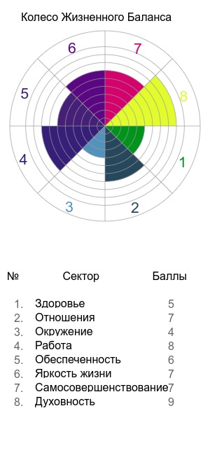
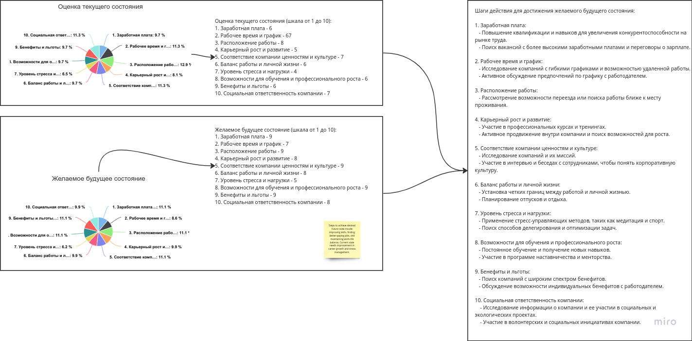
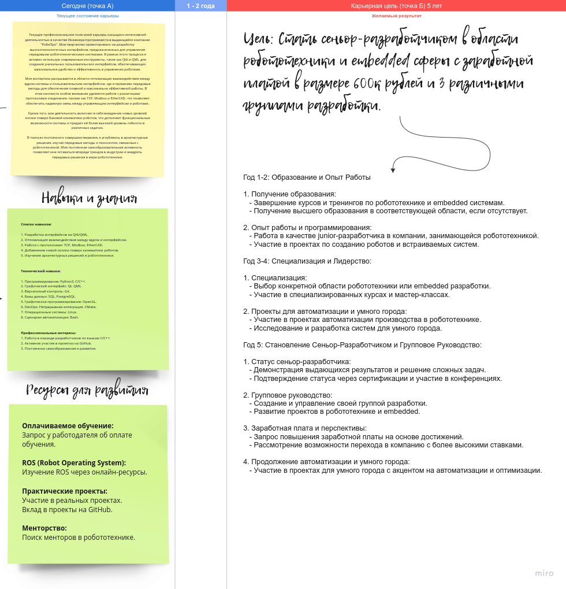
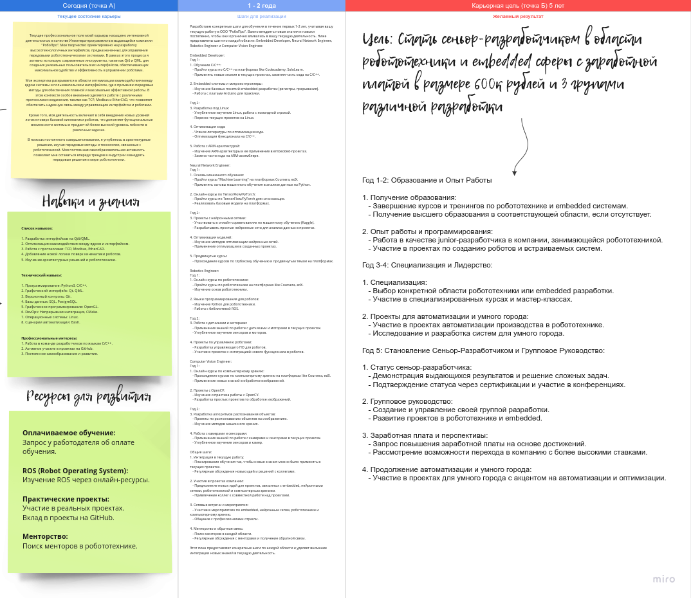

# Стратегия личного развития

## Колесо Жизненного Баланса

Колесо Жизненного Баланса представляет собой графическое изображение, разделенное на различные сектора, каждый из которых представляет собой определенную сферу вашей жизни. Эти сферы могут включать в себя работу, здоровье, отношения, личное развитие и другие аспекты вашей жизни. Идея заключается в том, чтобы визуализировать, насколько уравновешена ваша жизнь в этих различных областях.

Часто, если одна из сфер сильно выделяется или, наоборот, недостаточно развита, это может привести к дисбалансу и, как следствие, к ухудшению общего качества жизни. Колесо Жизненного Баланса помогает вам осознать, в какой сфере вам нужно уделить больше внимания, чтобы достичь гармонии и уравновешенности.

### Почему я исследую Колесо Жизненного Баланса

1. **Осознание приоритетов:** Колесо Жизненного Баланса помогает мне ясно определить, какие аспекты моей жизни требуют большего внимания и усилий. Это позволяет мне лучше понимать свои приоритеты и направлять усилия в те области, которые наиболее важны для моего благополучия.

2. **Управление временем:** Анализ баланса жизни помогает мне эффективнее распределять свое время между различными сферами. Это особенно полезно для избежания перегрузки в одной области жизни за счет ущерба другим.

3. **Стремление к гармонии:** Исследование Колеса Жизненного Баланса направлено на достижение гармонии в моей жизни. Уравновешенность между различными аспектами создает благоприятные условия для общего благосостояния и успеха.

4. **Личное развитие:** Постоянное наблюдение за балансом жизни способствует моему личному росту и развитию. Это стимулирует меня стремиться к постоянному улучшению в различных областях жизни.

Итак, исследование Колеса Жизненного Баланса стало важным элементом моей стратегии личного развития, помогая мне лучше понимать, куда направить свои усилия, чтобы достичь гармонии и удовлетворения в различных сферах моей жизни.

 

## Колесо карьерного баланса

## Карьерные цели

## Анализ вакансий

Анализ вакансий показал полное отсуствие необходимых навыков для развития в области автоматизации и робототехники. Ниже представлены обязанности и требования к кандидату, которые в большинстве своём отсуствуют у меня.

### Embedded Developer:
1. **Опыт работы с embedded системами:**
   - Проекты на микроконтроллерах (Arduino, Raspberry Pi).
   - Изучение документации и примеров по работе с embedded системами.

2. **Знание языков C/C++:**
   - Углубленное изучение C/C++.
   - Работа с микроконтроллерами на C/C++.

3. **Разработка драйверов и встроенных систем:**
   - Изучение создания драйверов под Linux.
   - Участие в проектах с встроенными системами.

4. **Оптимизация кода для встроенных устройств:**
   - Изучение методов оптимизации кода под ограниченные ресурсы.
   - Опыт оптимизации проектов для микроконтроллеров.

5. **Инструменты:**
   - **Языки:** C, C++
   - **Инструменты:** PlatformIO, Keil, IAR Embedded Workbench
   - **Дополнительно:** Знание архитектуры ARM, AVR.

### Neural Network Engineer:
1. **Знание основ машинного обучения и нейронных сетей:**
   - Онлайн-курсы по основам машинного обучения (Coursera, edX).
   - Книги и ресурсы по основам нейронных сетей.

2. **Опыт работы с фреймворками машинного обучения:**
   - Проекты с использованием TensorFlow или PyTorch.
   - Практика на Kaggle для решения задач машинного обучения.

3. **Разработка и оптимизация алгоритмов нейронных сетей:**
   - Углубленное изучение алгоритмов глубокого обучения.
   - Участие в проектах с оптимизацией нейронных сетей.

4. **Инструменты:**
   - **Фреймворки:** TensorFlow, PyTorch
   - **Библиотеки:** Keras, scikit-learn
   - **Дополнительно:** Изучение архитектур нейронных сетей, оптимизация моделей.

### Robotics Engineer:
1. **Опыт работы в области робототехники:**
   - Участие в проектах с робототехникой в рамках текущей работы.
   - Изучение проектов на GitHub с открытым кодом.

2. **Знание языков программирования для робототехники:**
   - Онлайн-курсы по программированию роботов на языке Python.
   - Изучение библиотеки ROS (Robot Operating System).

3. **Разработка управляющего ПО для роботов:**
   - Проекты по разработке ПО для управления роботами.
   - Изучение протоколов связи в робототехнике.

4. **Интеграция датчиков и моторов:**
   - Практика по интеграции датчиков и моторов в проектах.
   - Онлайн-ресурсы по работе с моторами и датчиками.

5. **Инструменты:**
   - **Языки:** Python, C++
   - **Фреймворки:** ROS
   - **Дополнительно:** Знание моторов, сенсоров, опыт работы с мехатроникой.

### Computer Vision Engineer:
1. **Опыт в области компьютерного зрения:**
   - Проекты по обработке изображений и видео.
   - Онлайн-курсы по компьютерному зрению.

2. **Знание библиотек для обработки изображений:**
   - Практика с OpenCV в проектах.
   - Изучение библиотек для компьютерного зрения.

3. **Разработка алгоритмов распознавания объектов:**
   - Проекты с алгоритмами распознавания объектов.
   - Изучение методов машинного зрения.

4. **Работа с камерами и сенсорами:**
   - Изучение работы с камерами и сенсорами в проектах.
   - Практика с использованием различных типов сенсоров.

5. **Инструменты:**
   - **Библиотеки:** OpenCV, Pillow
   - **Языки:** Python
   - **Дополнительно:** Изучение методов распознавания объектов, глубокого обучения для компьютерного зрения.

### Обучение:
1. **Онлайн-курсы:**
   - Coursera, edX, Udacity.
   - Курсы от ведущих университетов по каждой области.

2. **Практические проекты:**
   - Участие в проектах на GitHub.
   - Самостоятельные проекты для практики.

3. **Онлайн-сообщества и форумы:**
   - Участие в форумах по embedded, машинному обучению, робототехнике.
   - Общение с профессионалами в области.

4. **Менторство:**
   - Поиск ментора в каждой области.
   - Регулярные встречи для обсуждения вопросов и получения советов.

5. **Курсы по профессиональной подготовке:**
   - Учебные программы в учебных центрах и онлайн-школах.

Это подробный план, учитывающий необходимость обучения и практики в каждой области. Каждый пункт представляет собой конкретные шаги и ресурсы для достижения поставленных целей. Эти пункты могут быть использованы как для обучения, так и для практики для выхода на необходимую заработную вилку.

## Карьерные цели(дополнено)

## Анализ навыков

